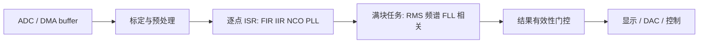

# F280049C Signal API 调用教程

这份教程把公开 API 放进实际数据流。先读 [快速开始](快速开始.md)，再读 [API 参考](API参考.md)，最后按下列完整示例替换合成数据为 ADC/DMA 缓冲区。所有程序都用 `gcc -std=c11 -Wall -Wextra -Werror` 验证。

## 1. 预处理和滤波

使用 [`preprocess_filter.c`](../examples/api_usage/preprocess_filter.c)。静态数组属于应用，不在库中动态分配。流程为 ADC code 经 `sigf32_linear_calibrate` 转物理量，`sigf32_dc_blocker_process` 消直流，DMA 块调用 `sigf32_fir_process_block`，随后 SOS `sigf32_biquad_process` 与 `sigf32_decimator_process`。仅当抽取函数返回 1 时发布抽取点。量程、采样率或系数改变时调用 reset 或重新 init；每一个状态数组只能由一个滤波器拥有。

## 2. RMS、频率、Goertzel 和频谱

使用 [`measure_spectrum.c`](../examples/api_usage/measure_spectrum.c)。DMA 填满 `N` 个元素后调用 `sigf32_stats`、`sigf32_frequency_zero_cross`、`sigf32_goertzel_multi`、`sigf32_spectrum_analyze` 和 `sigf32_cross_correlate`。频谱数组的 C 声明必须是 `float workspace[2 * (N / 2 + 1)];`；传给 `workspace_count` 的是元素数，不是 `sigf32_spectrum_workspace_size()` 返回的字节数。只有状态为 OK 且 `result.valid` 时更新 UI/DAC；无信号时保持上一读数并标无效。

## 3. 同步跟踪和自适应

使用 [`tracking_adaptive.c`](../examples/api_usage/tracking_adaptive.c)。块级 FLL 从过零获得捕获频率，初始化 PLL；随后 ISR 对每个样点执行 NCO、IQ、PLL 与 NLMS。`sigf32_nco_set_frequency` 不清相位，适合无相位跳变扫频。控制链先检查 `sigf32_pll_locked` 与 `sigf32_pll_frequency_hz`，再使用频率，避免捕获期驱动执行器。LMS/NLMS 的 `error` 输出是 `desired - predicted`，可做收敛监视。

## 4. TMU、CLA 和 RFFT

使用 [`platform_backends.c`](../examples/api_usage/platform_backends.c)。普通主机走 portable fallback；目标工程编译 TMU 文件时增加 `--tmu_support=tmu0`。CLA 适配器只展示可移入 CLA task 的点操作，状态与数据须安排在消息 RAM 并由应用同步。C2000Ware RFFT 由宏保护；传入的 input/output/twiddles 和 `RFFT_F32_STRUCT` 都由应用持有，输出经适配器转换到普通 real/imag bin 定义。

## 部署检查表

1. 在 SysConfig 配置 ADC、ePWM/DMA 和内存，算法库不假设任何板级引脚。
2. 在初始化阶段创建静态状态/工作区并检查每个 `sigf32_status_t`。
3. ISR 只运行逐点函数；FFT/相关/统计放到 DMA 满块或后台。
4. 对每个结果同时检查返回状态和 `valid/locked` 字段，异常计数交给遥测或故障页。
5. 目标构建再测量周期、RAM、栈和 CLA 同步，不将主机参考性能当作目标基准。
